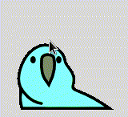

# Parrot eye

A joke application.

## Usage

`$ python3 main.py`

## Requires
- PySimpleGUI
- pyautogui

## ToDo
- Refactoring main.py

refer to : https://gist.github.com/kato-k/5f31d7a814c1f9aa6c64ac06bce0706b

## Author
KotaKato @kato-k

## Lisence
MIT

*NOTE*

The images of parrot are *not* licensed under MIT

[https://github.com/jmhobbs/cultofthepartyparrot.com](https://github.com/jmhobbs/cultofthepartyparrot.com)
